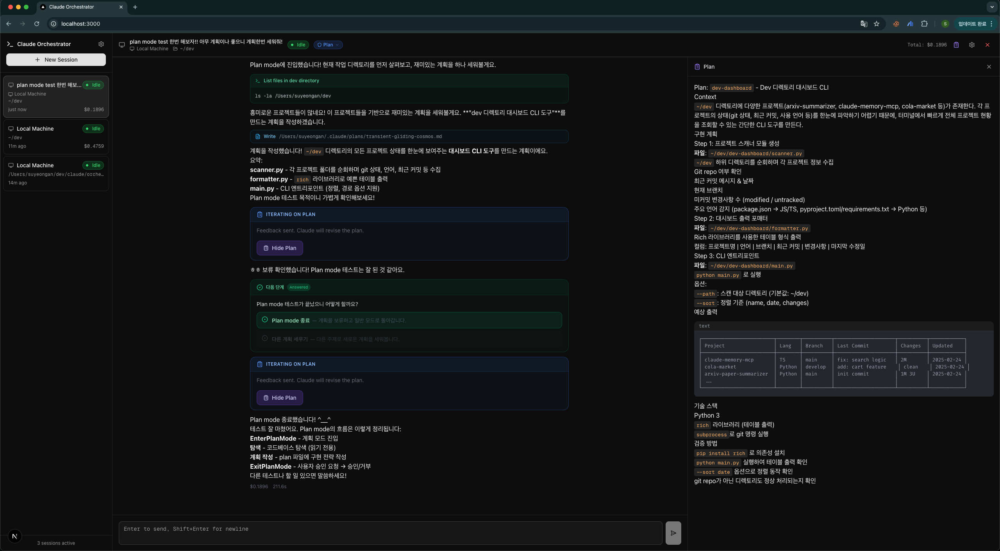
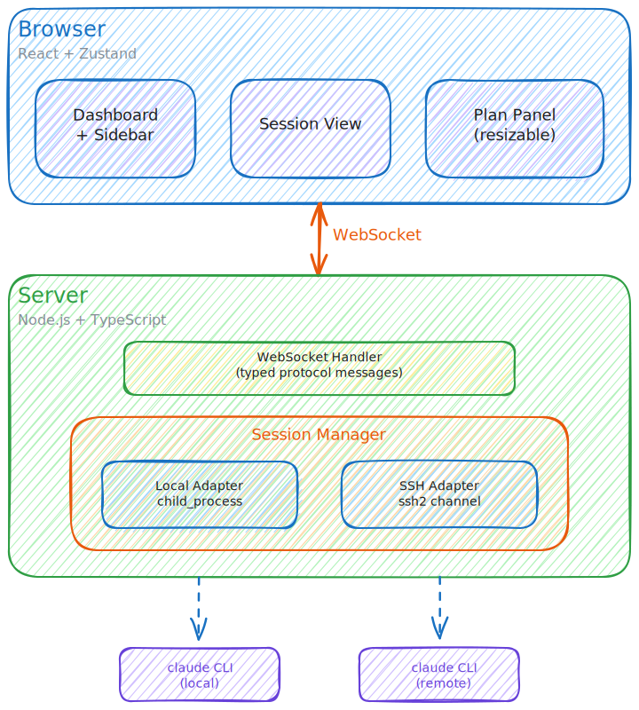

<div align="center">

# Claude Code Orchestrator

### Run dozens of Claude Code agents in parallel. One dashboard to rule them all.

[](LICENSE)
[](https://github.com/trillion-labs/claude-code-orchestrator/stargazers)
[](https://github.com/trillion-labs/claude-code-orchestrator/network/members)
[](https://nodejs.org)
[](https://www.typescriptlang.org)
[](https://nextjs.org)
[](https://docs.anthropic.com/en/docs/claude-code)

<br />

A web-based command center for managing multiple [Claude Code](https://docs.anthropic.com/en/docs/claude-code) sessions across local and remote machines. Launch, monitor, and interact with parallel AI coding agents from a single unified interface.

<br />

<picture>
  
</picture>

</div>

<br />

## 💬 What People Are Saying

> "I used to have 6 terminal tabs open, each with a Claude session. Now I just open the orchestrator and see everything at once. Game changer for multi-repo work." <br/>— Senior Engineer, Series B Startup

> "The SSH remote execution is incredibly useful. I spin up Claude agents on our GPU boxes and monitor them all from my laptop." <br/>— ML Infrastructure Lead

> "Permission modes saved us. We let juniors use 'Plan' mode for code review and seniors use 'Accept Edits' for fast iteration. One tool, different trust levels." <br/>— Engineering Manager

> "Worktree isolation per session means I can have 5 agents working on 5 different features simultaneously without any merge conflicts. It just works." <br/>— Full-Stack Developer

> "The Kanban board + Claude sessions combo is surprisingly powerful. I break down a project, assign tasks to sessions, and watch them get done in parallel." <br/>— Solo Founder

---

## ⚡ Quick Start

```bash
git clone https://github.com/trillion-labs/claude-code-orchestrator.git
cd claude-code-orchestrator
npm install
npm run dev
```

Open [http://localhost:3000](http://localhost:3000) — that's it.

> **Prerequisites:** Node.js 20+ and [Claude Code CLI](https://docs.anthropic.com/en/docs/claude-code) installed and authenticated.

## ✨ Features

### 🖥️ Multi-Session Dashboard
Launch multiple Claude Code sessions simultaneously. Stream real-time output with syntax-highlighted code blocks. Track status, cost, and progress per session — all at a glance.

### 🌐 Multi-Machine Execution
Run agents on your local machine **or** remote servers via SSH. Auto-discovers hosts from `~/.ssh/config` with connection pooling for performance. Define machines in a simple `machines.json`.

### 🔐 Four Permission Modes
Switch permission levels on the fly, per session:

| Mode | What it does |
|------|-------------|
| **Default** | Asks approval on every tool use |
| **Plan** | Read-only — analysis tools only |
| **Accept Edits** | Auto-approves file edits & safe commands |
| **No Restrictions** | Full autonomy |

### 🌿 Git Worktrees
Create isolated git worktrees per session with automatic branch creation. Each agent works in its own sandbox — no conflicts, no merge headaches.

### 📋 Plan Panel
A resizable side panel renders Claude's plan in rich Markdown with GFM tables and syntax highlighting. Drag to resize, scroll independently, and auto-restore on session resume.

### 🎨 Show User Panel
Claude can render rich HTML in a side panel — diagrams, charts, interactive visualizations, and formatted explanations. Supports CDN libraries like Chart.js, D3.js, and Mermaid out of the box.

### 📊 Project & Task Management
Create projects, break them into tasks, and link tasks to Claude sessions. A built-in Kanban board gives you visual task tracking across sessions and machines.

### 🔔 Attention System
A visual pulse indicator appears on session cards when user action is needed — permission requests, questions, or errors are surfaced instantly so nothing gets missed.

### 🔍 Session Discovery & Resume
Scan for existing Claude sessions on any machine and resume them with full chat history restoration, including plan panel recovery.

## 🏗️ Architecture

<div align="center">
  <picture>
    
  </picture>
</div>

> Edit the diagram yourself: open [`docs/architecture.excalidraw`](docs/architecture.excalidraw) in [excalidraw.com](https://excalidraw.com)

## 🛠️ Tech Stack

| Layer | Technology |
|-------|-----------|
| **Frontend** | [Next.js 16](https://nextjs.org) · [React 19](https://react.dev) · [TypeScript 5](https://www.typescriptlang.org) |
| **UI** | [Tailwind CSS 4](https://tailwindcss.com) · [shadcn/ui](https://ui.shadcn.com) · [Radix UI](https://www.radix-ui.com) · [Lucide Icons](https://lucide.dev) |
| **State** | [Zustand](https://zustand.docs.pmnd.rs) |
| **Real-time** | [WebSocket (ws)](https://github.com/websockets/ws) |
| **SSH** | [ssh2](https://github.com/mscdex/ssh2) |
| **Validation** | [Zod 4](https://zod.dev) |

## ⚙️ Configuration

Define your machines in `machines.json`:

```json
{
  "machines": [
    {
      "id": "local",
      "name": "Local Machine",
      "type": "local",
      "defaultWorkDir": "~"
    },
    {
      "id": "dev-server",
      "name": "Dev Server",
      "type": "ssh",
      "host": "dev.example.com",
      "username": "deploy",
      "defaultWorkDir": "/home/deploy/projects"
    }
  ]
}
```

SSH hosts from `~/.ssh/config` are auto-discovered alongside your configured machines.

## 📈 Star History

<div align="center">

[](https://star-history.com/#trillion-labs/claude-code-orchestrator&Date)

</div>

## 🤝 Contributing

Contributions are welcome! Please read our [Contributing Guide](CONTRIBUTING.md) and [Code of Conduct](CODE_OF_CONDUCT.md) before getting started.

## 📄 License

[MIT](LICENSE) © [Trillion Labs](https://trillionlabs.co/ko/)
